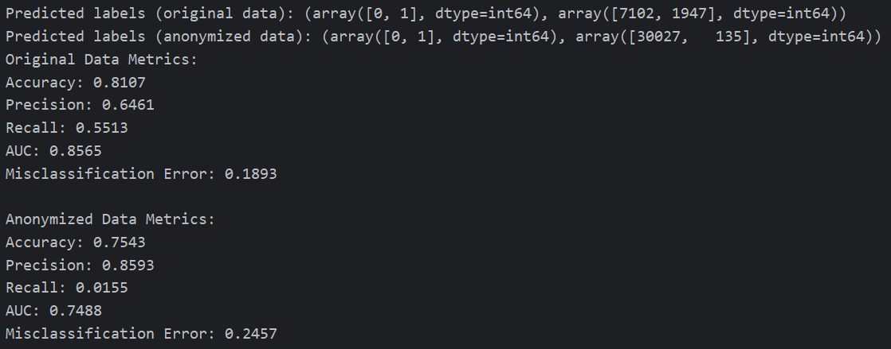

# 112-1-Data-Privacy-and-Security


### 1. Hw2

參考：https://github.com/kaylode/k-anonymity/tree/main

1. 透過 anonymize.py 產出隱私保護的.CSV檔案
```
# terminal, k可隨意改變
python anonymize.py --method=mondrian --k=10 --dataset=adult
```

2. 執行 compare.py 計算 Misclassification Error, Accuracy, Precision, Recall, AUC 指標

